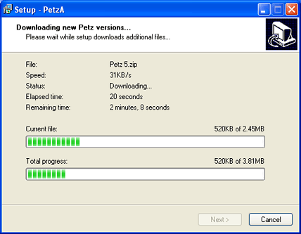

# InnoTools Downloader
InnoTools Downloader is an Inno Setup script and DLL which allows you to download files as part of your installation. 

## Features
- Support Inno Setup 5 ANSI / Unicode
- Downloads from HTTP or FTP
- Download with a progress screen, or without any UI
- Send data to your webserver with easy POST requests, and read the responses
- An example shows how your installer can check for updates before installation begins, and download an updated installer
- Includes Brazilian Portuguese, Dutch, English, French, Greek, and Spanish translations

I'm using version 0.4.x with good success in my program PetzA (Screenshot below), why not try it out and tell me how it goes for you? :) 

Documentation is included with ITD as help file. You can also [view the same documentation online](http://www.sherlocksoftware.org/innotools/itdhelp/index.html). 

 

## Installation

Grab the installer from the [Releases tab](https://github.com/thenickdude/InnoTools-Downloader/releases). Run it
to install ITD to `C:\Program Files (x86)\Sherlock Software\InnoTools\Downloader`. Go there to check
out the help file and the example .iss files that show you how to use InnoTools Downloader.

Each example begins by including `itdownload.iss`, which bundles ITD into your installer, then makes calls to it
during installation to start downloads.

## Included examples
1. Downloads two files during installation, then installs those files into the destination
2. Send data to your webserver over POST during installation, and read the response
3. Check for a newer version of the installer before installation begins, download it and run it if found.
4. Use ITD translations
5. Integrate with InnoTools Tray to allow the installer to minimise to the tray during installation. Demonstrates
 sending custom HTTP User Agent strings
6. Allow installation to continue even if some non-critical files couldn't be successfully downloaded

## Licenses

ITD itself is licensed under the WTFPLv2, see License.md for more details.

This project contains the [Ararat Synapse networking library](http://www.ararat.cz/synapse/doku.php/start), with the following license:

    Redistribution and use in source and binary forms, with or without modification, are permitted provided that the
    following conditions are met:
    
    Redistributions of source code must retain the above copyright notice, this list of conditions and the following 
    disclaimer.
    
    Redistributions in binary form must reproduce the above copyright notice, this list of conditions and the following 
    disclaimer in the documentation and/or other materials provided with the distribution.
    
    Neither the name of Lukas Gebauer nor the names of its contributors may be used to endorse or promote products 
    derived from this software without specific prior written permission.
    
    THIS SOFTWARE IS PROVIDED BY THE COPYRIGHT HOLDERS AND CONTRIBUTORS “AS IS” AND ANY EXPRESS OR IMPLIED WARRANTIES,
    INCLUDING, BUT NOT LIMITED TO, THE IMPLIED WARRANTIES OF MERCHANTABILITY AND FITNESS FOR A PARTICULAR PURPOSE ARE 
    DISCLAIMED. IN NO EVENT SHALL THE REGENTS OR CONTRIBUTORS BE LIABLE FOR ANY DIRECT, INDIRECT, INCIDENTAL, SPECIAL, 
    EXEMPLARY, OR CONSEQUENTIAL DAMAGES (INCLUDING, BUT NOT LIMITED TO, PROCUREMENT OF SUBSTITUTE GOODS OR SERVICES; 
    LOSS OF USE, DATA, OR PROFITS; OR BUSINESS INTERRUPTION) HOWEVER CAUSED AND ON ANY THEORY OF LIABILITY, WHETHER IN 
    CONTRACT, STRICT LIABILITY, OR TORT (INCLUDING NEGLIGENCE OR OTHERWISE) ARISING IN ANY WAY OUT OF THE USE OF THIS 
    SOFTWARE, EVEN IF ADVISED OF THE POSSIBILITY OF SUCH DAMAGE.